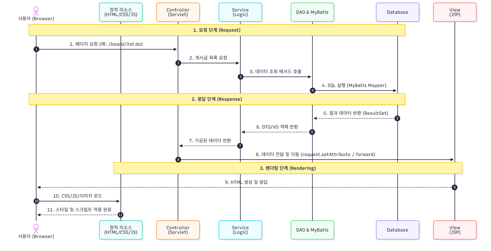
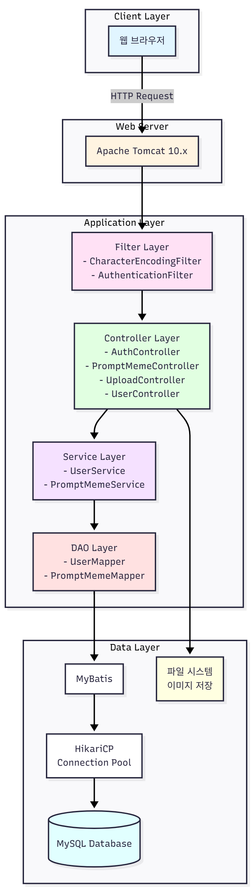

# Pommy

**프롬프트 밈을 발견하고, 공유하는 공간**

Pommy는 재미있는 AI 프롬프트 밈을 모아보고, 나만의 밈을 업로드할 수 있는 웹 플랫폼입니다. 다양한 AI 도구(GPT, Gemini, Midjourney, SORA)로 생성된 프롬프트 밈을 공유하고 탐색할 수 있습니다.

## 📋 목차

- [팀원](#팀원)
- [주요 기능](#주요-기능)
- [기술 스택](#기술-스택)
- [프로젝트 구조](#프로젝트-구조)
- [시작하기](#시작하기)
- [데이터베이스 설정](#데이터베이스-설정)
- [빌드 및 실행](#빌드-및-실행)
- [주요 기능 설명](#주요-기능-설명)
- [전체 시퀀스 다이어그램](#전체-시퀀스-다이어그램)
- [라이선스](#라이선스)

## 👥 팀원

Pommy 프로젝트를 제작한 팀원들을 소개합니다.

|      이호근     |         신윤철         |         박수민         |
| :------------------------------------------------------------------------------: | :---------------------------------------------------------------------------------------------------------------------------------------------------: | :---------------------------------------------------------------------------------------------------------------------------------------------------: |
|          |                          |                          |
|   [@2ghrms](https://github.com/2ghrms)   |    [@Shin-Yun-Cheol](https://github.com/Shin-Yun-Cheol)  |    [@ssumai-kr](https://github.com/ssumai-kr)  |


## ✨ 주요 기능

- **사용자 인증**: 회원가입, 로그인, 로그아웃 기능
- **프롬프트 밈 관리**: 
  - 프롬프트 밈 업로드 (이미지, 제목, 설명, 프롬프트 내용)
  - 프롬프트 밈 조회 및 상세 보기
  - 프롬프트 밈 수정 및 삭제
- **검색 기능**: 제목 및 설명 기반 검색
- **랭킹 시스템**: 인기 프롬프트 밈 랭킹 표시
- **AI 타입 분류**: GPT, Gemini, Midjourney, SORA 지원
- **클립보드 복사**: 프롬프트 내용을 클립보드로 복사
- **이미지 미리보기**: 업로드 전 이미지 미리보기 기능

## 🛠 기술 스택

### Backend
- **Java 21**: 프로그래밍 언어
- **Jakarta Servlet 6.0**: 웹 서버 기술
- **JSP**: 뷰 템플릿
- **MyBatis 3.5.11**: ORM 프레임워크
- **MySQL 8.0**: 데이터베이스
- **HikariCP 5.0.1**: 커넥션 풀
- **BCrypt**: 비밀번호 해싱
- **SLF4J + Logback**: 로깅

### Frontend
- **HTML/CSS/JavaScript**: 클라이언트 사이드

### Build Tool
- **Maven 4.0**: 빌드 및 의존성 관리

## 📁 프로젝트 구조

```
Web/
├── src/
│   ├── main/
│   │   ├── java/
│   │   │   └── com/pommy/
│   │   │       ├── controller/          # 컨트롤러 (요청 처리)
│   │   │       │   ├── AuthController.java
│   │   │       │   ├── IndexController.java
│   │   │       │   ├── MypageController.java
│   │   │       │   ├── PromptMemeController.java
│   │   │       │   ├── UploadController.java
│   │   │       │   └── UserController.java
│   │   │       ├── dao/                  # 데이터 접근 객체
│   │   │       │   ├── PromptMemeMapper.java
│   │   │       │   └── UserMapper.java
│   │   │       ├── filter/               # 필터 (인증, 인코딩)
│   │   │       │   ├── AuthenticationFilter.java
│   │   │       │   └── CharacterEncodingFilter.java
│   │   │       ├── model/                # 엔티티 모델
│   │   │       │   ├── AIType.java
│   │   │       │   ├── PromptMeme.java
│   │   │       │   └── User.java
│   │   │       ├── service/              # 비즈니스 로직
│   │   │       │   ├── PromptMemeService.java
│   │   │       │   ├── PromptMemeServiceImpl.java
│   │   │       │   ├── UserService.java
│   │   │       │   └── UserServiceImpl.java
│   │   │       └── util/                 # 유틸리티
│   │   │           ├── MyBatisUtil.java
│   │   │           └── PasswordUtil.java
│   │   ├── resources/
│   │   │   └── db.properties            # 데이터베이스 설정
│   │   └── webapp/
│   │       ├── images/                  # 이미지 리소스
│   │       ├── js/                      # JavaScript 파일
│   │       │   ├── clipboard.js
│   │       │   ├── imagePreview.js
│   │       │   ├── ranking.js
│   │       │   └── toggleSearch.js
│   │       └── WEB-INF/
│   │           ├── jsp/                 # JSP 페이지
│   │           │   ├── auth/           # 인증 관련
│   │           │   ├── error/          # 에러 페이지
│   │           │   ├── home/           # 홈 페이지
│   │           │   ├── prompt/         # 프롬프트 밈 관련
│   │           │   └── user/           # 사용자 관련
│   │           ├── jspf/               # JSP Fragment
│   │           └── web.xml             # 웹 설정
├── database/
│   └── create_table.sql                # 데이터베이스 스키마
├── pom.xml                              # Maven 설정
└── README.md                            # 프로젝트 문서
```

## 🚀 시작하기

### 필수 요구사항

- Java 21 이상
- Maven 4.0 이상
- MySQL 8.0 이상
- Apache Tomcat 10.x 이상 (또는 Jakarta EE 호환 서버)

### 데이터베이스 설정

1. MySQL 데이터베이스 생성 및 테이블 생성:

```bash
mysql -u root -p < database/create_table.sql
```

또는 MySQL 클라이언트에서 직접 실행:

```sql
CREATE DATABASE IF NOT EXISTS pommy CHARACTER SET utf8mb4 COLLATE utf8mb4_unicode_ci;
USE pommy;
-- database/create_table.sql 파일의 내용 실행
```

2. 데이터베이스 연결 설정:

`src/main/resources/db.properties` 파일을 삽입하여 데이터베이스 연결 정보를 설정하세요:

```properties
db.driver=com.mysql.cj.jdbc.Driver
db.url=jdbc:mysql://localhost:3306/pommy?useSSL=false&serverTimezone=UTC&characterEncoding=UTF-8
db.username=your_username
db.password=your_password
```

### 빌드 및 실행

1. 프로젝트 클론:

```bash
git clone <repository-url>
cd Web
```

2. Maven을 사용하여 프로젝트 빌드:

```bash
mvn clean package
```

3. WAR 파일 배포:

빌드된 `target/pommy.war` 파일을 Tomcat의 `webapps` 디렉토리에 배포하거나, IDE에서 직접 실행합니다. 
또는 컨테이너 이미지를 통해서 배포합니다.

4. 애플리케이션 접속:

브라우저에서 `http://localhost:8080/pommy/` 접속

## 📖 주요 기능 설명

### 사용자 인증

- **회원가입** (`/auth/signup`): 새로운 사용자 계정 생성
- **로그인** (`/auth/login`): 기존 사용자 로그인
- **로그아웃**: 세션 종료
- 비밀번호는 BCrypt를 사용하여 해싱되어 저장됩니다.

### 프롬프트 밈 관리

- **업로드** (`/prompt/upload`): 
  - 제목, 설명, 프롬프트 내용 입력
  - 이미지 파일 업로드 (최대 10MB)
  - AI 타입 선택 (GPT, Gemini, Midjourney, SORA)
  - SNS 링크 추가 (선택사항)

- **조회**:
  - 메인 페이지 (`/prompt/main`): 전체 프롬프트 밈 목록
  - 상세 페이지 (`/prompt/detail`): 개별 프롬프트 밈 상세 정보
  - 조회수 자동 증가

- **수정/삭제**: 작성자만 자신의 프롬프트 밈을 수정/삭제할 수 있습니다.

### 검색 기능

- 제목 및 설명 기반 전체 텍스트 검색
- 검색 결과 페이지에서 필터링 및 정렬 가능

### 랭킹 시스템

- 인기 프롬프트 밈을 조회수 기준으로 랭킹 표시
- 자동 슬라이더 기능으로 상위 3개 프롬프트 밈 순환 표시

### 클립보드 복사

- 프롬프트 내용을 클립보드로 한 번에 복사
- 복사 성공 시 시각적 피드백 제공

## 🔒 보안 기능

- **인증 필터**: 보호된 페이지 접근 시 로그인 확인
- **비밀번호 해싱**: BCrypt를 사용한 안전한 비밀번호 저장
- **세션 관리**: 서버 측 세션을 통한 사용자 인증 상태 관리
- **파일 업로드 제한**: 최대 파일 크기 제한 (10MB)

## 📝 API 엔드포인트

| 경로 | 메서드 | 설명 |
|------|--------|------|
| `/` | GET | 홈 페이지 |
| `/auth/signup` | GET/POST | 회원가입 |
| `/auth/login` | GET/POST | 로그인 |
| `/auth/logout` | POST | 로그아웃 |
| `/prompt/main` | GET | 프롬프트 밈 목록 |
| `/prompt/detail` | GET | 프롬프트 밈 상세 |
| `/prompt/upload` | GET/POST | 프롬프트 밈 업로드 |
| `/prompt/edit` | GET/POST | 프롬프트 밈 수정 |
| `/prompt/delete` | POST | 프롬프트 밈 삭제 |
| `/prompt/search` | GET | 프롬프트 밈 검색 |
| `/user/mypage` | GET | 마이페이지 |
| `/user/edit` | GET/POST | 사용자 정보 수정 |

## 🗄 데이터베이스 스키마

### users 테이블
- 사용자 정보 저장 (아이디, 비밀번호 해시, 닉네임)

### prompt_memes 테이블
- 프롬프트 밈 정보 저장 (제목, 설명, 프롬프트 내용, 이미지 URL, AI 타입, 조회수 등)

### sessions 테이블
- 세션 정보 저장 (세션 ID, 사용자 ID, 만료 시간)

---

## 📊 전체 구조도

### 시퀀스 다이어그램



Pommy 애플리케이션의 주요 기능별 시퀀스 다이어그램입니다. 사용자 인증, 프롬프트 밈 업로드, 조회, 검색, 수정/삭제 등의 전체 플로우를 보여줍니다.

### 시스템 아키텍처



Pommy 애플리케이션의 전체 시스템 아키텍처입니다. 클라이언트 레이어부터 데이터 레이어까지의 구조와 각 컴포넌트 간의 관계를 보여줍니다.


## 📄 라이선스

이 프로젝트는 MIT 라이선스 하에 배포됩니다. 자세한 내용은 `LICENSE` 파일을 참조하세요.

---

**Pommy** - 프롬프트 밈을 발견하고, 공유하는 공간 🎨
